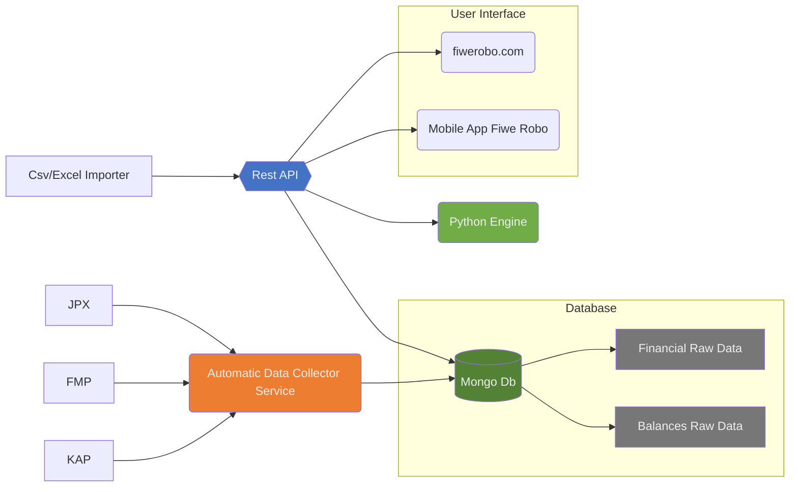

# Fiwe Robo
FiweRobo Artificial Intelligence on Big Data Analyzing
- [Structure](#structure)
- [Project Description](#project-description)
- [config.json](#configjson)
- [REST API](/docs/rest-api.md)

## Structure




## Project Description

>Source files explaning below

```yml
db: # Database functions and collections definitions
  collections:  # Mongoose Collection Schemes files `*.collection.js`
  db-loader.js: # Database module
lib:
  auth.js:  # Token encode/decode functions for the project Access Token 
  http-server.js: # http server for `REST API` and `Socket Service` publishing
resources:  # some resource files (image, shellscript, static json files etc.)
  install-server.sh: # installation shell script. it installs required applications and services for ubuntu server 20.04
rest-api: # `REST API` service (`restApi`)
  controllers:  # `REST API` functions files `*.controller.js`
  app.js:   # `REST API` start file. using express framework
  routes.js:  # Managing url path routes
websocket-api: # Websocket API (`wsApi` || `parasiteAPI`)
    sockets: # socket server controller files folder
      pong.socket.js: 
      subscribe.socket.js: 
    websocket-api.js: # Socket Server
config.json:  # start up configuration file
initialize.js:  # initializing before starting up
start.js:   # start up
```


## config.json
```yml
{
  "name": "fx-connector",
  "version": "1.0.0",
  "description": "Connector application for multiple forex services",
  "httpserver": { "port": 3900 },
  "mongodb": { # Mongo DB connection string
    "newUserDbSyntax": "fw${_id}",
    "master": "mongodb://localhost:27017/fiweRobo",
    "server1": "mongodb://localhost:27017/",
    "server2": "",
    "server3": ""
  },
  "redis": { # Redis server options.
    "url": "redis://localhost:6379"
  },
  "websocketApi": {
    "socketCorsDomainList": [ # websocket allowed cors domain list
      "fiwerobo.com","test.fiwerobo.com",
    ]
  },
  "token": { # Auhentication token generator options
    "phrase": "helloSecretWorld",  # encription phrase
    "expiresIn": 86400 # expressed in seconds 
  },
  "tmpDir": "/tmp", # temp folder using for dump data or debug issues
  "status": "development" #  can be 'development', 'test' or 'release'
}
```