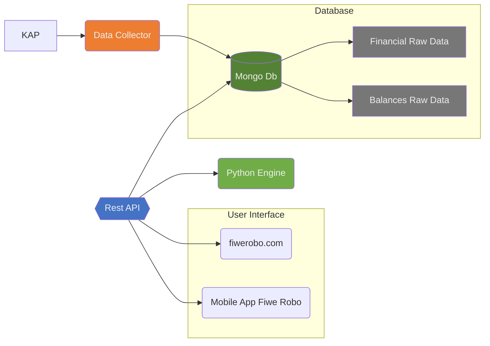

# fiwe
Fiwe Artificial Intelligence on Big Data Analyzing
- [Structure](#structure)

## Structure

```mermaid
graph LR
dc(Data Collector);style dc fill:#ed7d31,color:#eee;
mdb[(Mongo Db)];style mdb fill:#548235,color:#eee;
ww(fiwerobo.com)
mob(Mobile App Fiwe Robo)
ra{{Rest API}};style ra fill:#4472c4,color:#eee;
pe(Python Engine);style pe fill:#70ad47,color:#eee;
frd[Financial Raw Data]
bld[Balances Raw Data]

KAP --> dc
dc --> mdb

ra -->mdb
ra -->pe
mdb-->frd
mdb-->bld
subgraph Database
mdb
frd
bld
end

ra -->ww
ra-->mob
subgraph UI [User Interface]
ww
mob
end

classDef dbCollections fill:#777,color:#eee;
class frd,bld dbCollections;
%% classDef ppS fill:#5b9bd5,color:#eee;
%% class KAP,kraken,xchange,liverates ppS;
```
